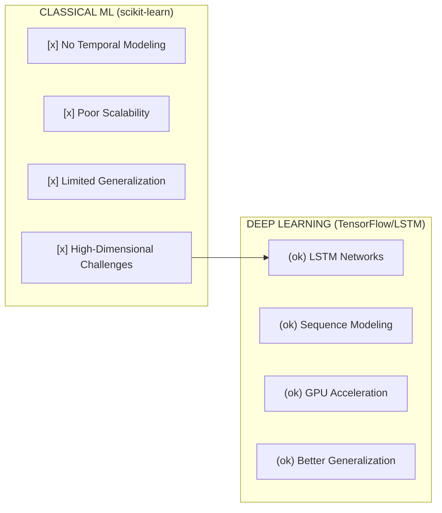
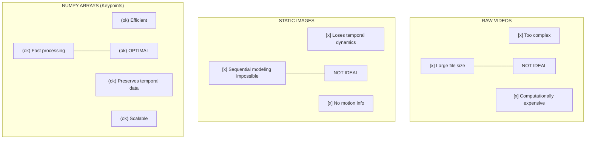
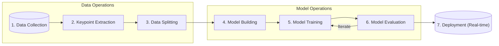
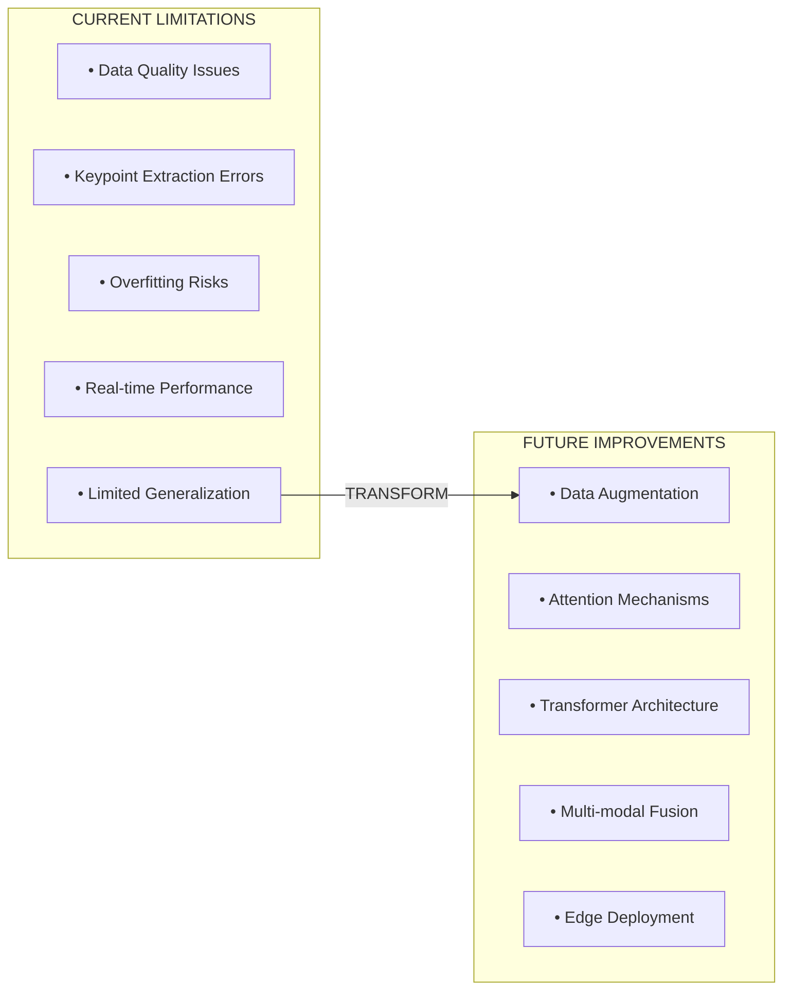
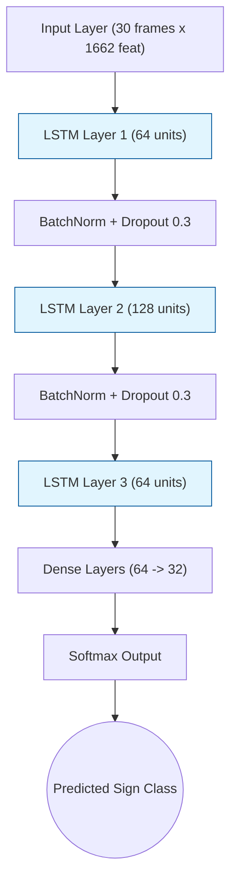
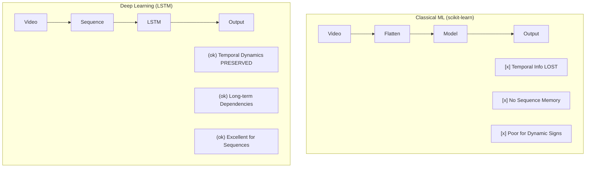
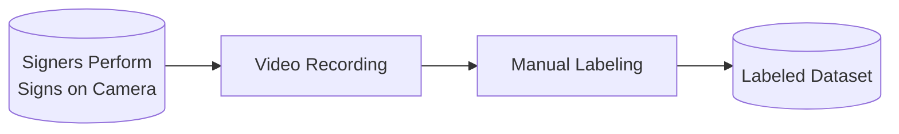
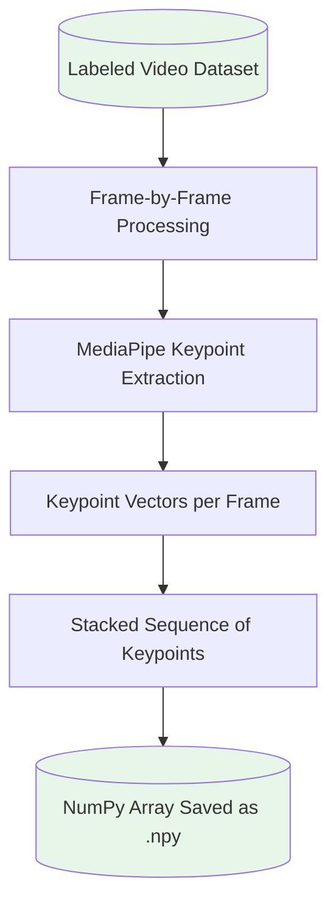
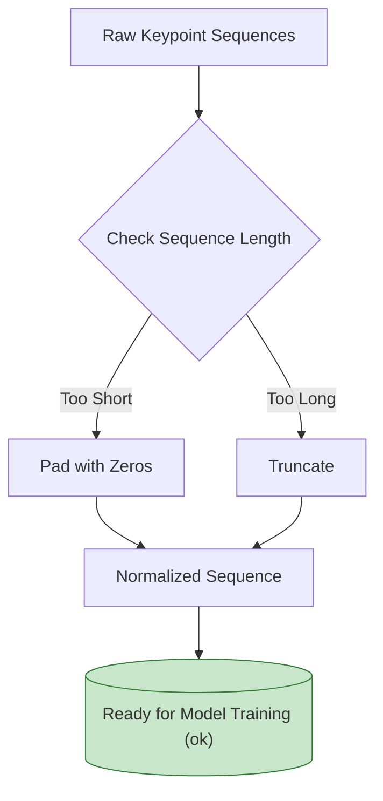
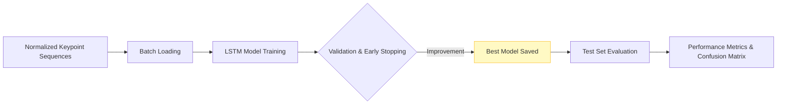

# Sign Language Recognition Model: Documentation & Rationale

---

## 1. The Current Architecture: A Deep Dive into the scikit-learn Approach

In the initial phase of the SignLens project, the goal was to build a system capable of recognizing sign language gestures using machine learning. The first architecture was based on classical machine learning algorithms provided by the scikit-learn library. This approach was chosen for its simplicity, ease of use, and the wealth of documentation and community support available for scikit-learn. However, as the project evolved, several limitations became apparent, prompting a transition to more advanced deep learning techniques. This section provides a comprehensive, step-by-step narrative of the scikit-learn-based system, its data pipeline, and the technical challenges encountered.

### Data Acquisition and Preprocessing

The foundation of any machine learning system is the data it learns from. In the context of sign language recognition, the raw data consists of videos of individuals performing various signs. Each video captures a sequence of frames, and each frame contains rich information about the position and movement of the hands, face, and body. To make this data suitable for machine learning, it must be transformed into a structured format that models can process.

The first step in the pipeline is keypoint extraction. Using the MediaPipe library, each frame of the video is analyzed to detect and extract keypoints corresponding to the face, pose, and hands. MediaPipe provides a set of coordinates for each detected landmark, such as the tip of the index finger, the wrist, the nose, and so on. These coordinates are typically represented as (x, y, z) values, where x and y denote the position in the image, and z represents the depth or relative distance from the camera.

Once keypoints are extracted from each frame, the next challenge is to represent the entire video sequence as a single feature vector. In the scikit-learn approach, this is often done by flattening the keypoints from all frames into one long vector, or by computing summary statistics such as the mean, standard deviation, or maximum value for each keypoint across the sequence. This process, while straightforward, has significant implications for the model's ability to learn temporal patterns, as it effectively discards the order and dynamics of the movements.

For example, consider a sign that involves moving the hand from left to right. If the keypoints are averaged across all frames, the model only sees the average position of the hand, not the fact that it moved from one side to the other. This loss of temporal information is a critical flaw in the classical approach, as sign language is inherently dynamic and relies on the sequence of movements to convey meaning.

### Feature Engineering and Data Formatting

After flattening or summarizing the keypoints, the resulting feature vectors are organized into a dataset suitable for scikit-learn models. Each sample in the dataset corresponds to a single video (or sign instance), and is represented by a vector of numerical features. The label for each sample is the sign being performed, such as "A", "B", "Hello", or "Thank you". The dataset is typically split into training and testing sets using scikit-learn's `train_test_split` function, ensuring that the model is evaluated on data it has not seen during training.

Feature engineering may also involve normalization or standardization of the keypoint values, to ensure that all features are on a similar scale. This can help improve the performance and stability of classical models, which are sensitive to the range and distribution of input features. In some cases, dimensionality reduction techniques such as Principal Component Analysis (PCA) are applied to reduce the number of features and mitigate the curse of dimensionality.

### Model Selection and Training

With the data prepared, the next step is to select and train a machine learning model. Scikit-learn offers a wide range of algorithms, including Support Vector Machines (SVM), Random Forests, Logistic Regression, k-Nearest Neighbors (k-NN), and more. Each algorithm has its own strengths and weaknesses, and the choice of model depends on factors such as the size and complexity of the dataset, the number of classes, and the desired trade-off between accuracy and interpretability.

In the context of sign language recognition, SVMs and Random Forests are popular choices due to their ability to handle high-dimensional data and multi-class classification tasks. The model is trained on the feature vectors and labels from the training set, using scikit-learn's `fit` method. Hyperparameter tuning may be performed using grid search or cross-validation, to optimize the model's performance.

### Evaluation and Performance Metrics

After training, the model is evaluated on the test set to assess its accuracy, precision, recall, and other relevant metrics. Scikit-learn provides a suite of tools for model evaluation, including confusion matrices, classification reports, and ROC curves. These metrics help quantify the model's ability to correctly classify signs and identify areas for improvement.

However, despite achieving reasonable accuracy on the test set, several limitations became apparent during real-world testing. The model often struggled to recognize signs performed by different individuals, in varying lighting conditions, or with subtle variations in movement. This lack of robustness and generalization is a direct consequence of the loss of temporal information and the limited capacity of classical models to learn complex patterns.

### Technical Flaws and Limitations

The most significant flaw in the scikit-learn approach is the inability to model temporal dynamics. By flattening or summarizing keypoints across frames, the model loses the sequence information that is essential for distinguishing between signs. For example, two signs may involve the same hand positions, but performed in a different order or with different timing. Classical models cannot capture these nuances, leading to frequent misclassifications.

Another limitation is scalability. As the number of keypoints and frames increases, the feature vectors become extremely high-dimensional, making the models harder to train and more prone to overfitting. Dimensionality reduction techniques can help, but they also risk discarding important information. Furthermore, classical models do not scale well to large datasets or complex classification tasks, and their performance plateaus as the complexity of the problem increases.

Generalization is also a major challenge. The model may perform well on the training data, but fail to recognize signs performed by new users, in different environments, or with slight variations in execution. This is partly due to the limited expressiveness of classical models, and partly due to the lack of temporal modeling.

### Summary of the scikit-learn Approach


---

## 2. Motivation for Transitioning to Deep Learning with TensorFlow

Recognizing the limitations of the scikit-learn approach, the next logical step in the evolution of the SignLens project was to explore deep learning techniques. Deep learning has revolutionized the field of computer vision and sequence modeling, offering powerful tools for learning complex patterns from large and high-dimensional datasets. In particular, TensorFlow, with its Keras API, provides a flexible and scalable framework for building, training, and deploying deep neural networks.

The motivation for transitioning to deep learning is rooted in the nature of sign language itself. Unlike static gestures, sign language is composed of sequences of movements, where the order, timing, and dynamics of the gestures are critical for conveying meaning. Classical machine learning models, as discussed previously, are fundamentally limited in their ability to capture these temporal dependencies. Deep learning models, on the other hand, are designed to learn from sequences, making them ideally suited for sign language recognition.

### Technical Rationale for Deep Learning

At the heart of deep learning's success in sequence modeling is the concept of recurrent neural networks (RNNs), and more specifically, Long Short-Term Memory (LSTM) networks. LSTMs are a type of RNN that can learn long-term dependencies in sequential data, making them particularly effective for tasks such as speech recognition, language translation, and gesture analysis. Unlike classical models, LSTMs maintain a memory of previous inputs, allowing them to model the temporal dynamics of sign language gestures.

TensorFlow's Keras API makes it straightforward to build and experiment with LSTM architectures. By stacking multiple LSTM layers, adding regularization techniques such as Dropout and BatchNormalization, and tuning hyperparameters, it is possible to create models that are both expressive and robust. These models can learn to recognize subtle differences in movement, timing, and order, leading to significantly improved accuracy and generalization compared to classical approaches.

The transition to deep learning directly addresses the key flaws of the scikit-learn architecture:



1. **Temporal Modeling:** Deep learning models, especially LSTMs, are designed to process sequences of data. This allows them to learn the order and dynamics of sign language gestures, which are lost in classical models.

2. **Scalability:** Neural networks can handle large, high-dimensional datasets efficiently, leveraging GPU acceleration for fast training and inference. This makes them suitable for real-world applications with many classes and complex gestures.

3. **Generalization:** Deep models can learn invariant features that generalize across different signers, backgrounds, and lighting conditions. Techniques such as data augmentation and regularization further enhance robustness.

4. **Flexibility:** TensorFlow and Keras provide a rich ecosystem for model development, including support for custom layers, advanced architectures (e.g., GRU, CNN, Transformers), and integration with deployment tools.

### Advantages of TensorFlow/Keras

TensorFlow is one of the most widely used deep learning frameworks, supported by a large community and extensive documentation. Its Keras API offers a high-level interface for building models, making it accessible to both beginners and experts. Key advantages include:

- **Ease of Use:** Keras provides simple, intuitive APIs for defining, training, and evaluating models.
- **Performance:** TensorFlow supports GPU and TPU acceleration, enabling fast training on large datasets.
- **Extensibility:** Users can easily experiment with different architectures, loss functions, and optimization strategies.
- **Deployment:** Models can be exported and deployed to a variety of platforms, including mobile devices and web applications.
- **Visualization:** Tools such as TensorBoard allow for real-time monitoring of training progress and model performance.

### Overcoming New Challenges

While deep learning offers significant advantages, it also introduces new challenges. Training deep neural networks requires careful management of data quality, model complexity, and overfitting. Collecting a large and diverse dataset is essential for achieving good generalization. Regularization techniques such as Dropout and BatchNormalization help prevent overfitting, while early stopping and model checkpointing ensure that the best model is saved during training.

Debugging and interpreting deep models can be more complex than classical approaches. Visualization tools, model summaries, and systematic experimentation are crucial for understanding model behavior and diagnosing issues. Despite these challenges, the benefits of deep learning far outweigh the drawbacks, making it the preferred approach for sign language recognition.

### Summary

The decision to transition from scikit-learn to TensorFlow was driven by the need to model the temporal dynamics of sign language, scale to larger and more complex datasets, and achieve robust generalization in real-world scenarios. Deep learning, and LSTM networks in particular, provide the tools necessary to overcome the limitations of classical models and unlock new levels of performance and accuracy. The following sections will delve into the specifics of data representation, model architecture, and the training pipeline for the proposed deep learning system.

---

One of the most critical decisions in designing a sign language recognition system is how to represent the data that will be used to train and evaluate the model. The choice of data representation has profound implications for the model's ability to learn meaningful patterns, generalize to new examples, and perform efficiently in real-world scenarios. In the context of deep learning, and particularly for sequence models such as LSTMs, the use of NumPy arrays to store sequences of keypoints extracted from video frames is both a practical and technically sound approach.



### The Journey from Raw Video to Structured Data

The raw data for sign language recognition consists of videos of individuals performing various signs. Each video is a rich source of information, capturing the movement of the hands, face, and body over time. However, raw video data is high-dimensional, unstructured, and difficult to process directly with machine learning models. To make this data usable, it must be transformed into a structured format that preserves the essential information while reducing complexity.

The first step in this transformation is keypoint extraction. Using the MediaPipe library, each frame of the video is analyzed to detect and extract keypoints corresponding to the face, pose, and hands. MediaPipe provides a set of coordinates for each detected landmark, such as the tip of the index finger, the wrist, the nose, and so on. These coordinates are typically represented as (x, y, z) values, where x and y denote the position in the image, and z represents the depth or relative distance from the camera.

For each frame, the extracted keypoints are concatenated into a single vector, representing the spatial configuration of the face, pose, and hands at that moment in time. By stacking these vectors across all frames in the video, we obtain a two-dimensional NumPy array, where each row corresponds to a frame and each column corresponds to a specific keypoint coordinate. This array captures the temporal evolution of the keypoints, preserving the order and dynamics of the movements.

### Why Not Use Raw Videos or Images?

It is natural to ask why we do not use raw videos or images as input to the model. While deep learning models such as convolutional neural networks (CNNs) are capable of processing images and videos directly, this approach is computationally expensive and requires vast amounts of data to achieve good performance. Moreover, sign language recognition is fundamentally a problem of understanding movement and spatial relationships, which are more efficiently captured by keypoint coordinates than by raw pixel values.

Using raw videos would require the model to learn to detect and localize keypoints as part of the training process, adding unnecessary complexity and increasing the risk of overfitting. By extracting keypoints in a preprocessing step, we reduce the dimensionality of the data, focus the model's attention on the most relevant features, and make the training process more efficient and robust.

Images, on the other hand, are suitable for recognizing static gestures, but they fail to capture the temporal dynamics of sign language. Most signs involve sequences of movements, and the meaning of a sign is often determined by the order and timing of these movements. By representing the data as sequences of keypoints, we enable the model to learn from the temporal patterns that are essential for accurate recognition.

### Technical Advantages of NumPy Arrays

NumPy arrays offer several technical advantages as a data representation for deep learning:

1. **Efficiency:** NumPy arrays are compact and efficient, allowing for fast storage, retrieval, and manipulation of large datasets. They are the standard data format for scientific computing in Python, and are fully compatible with TensorFlow and other deep learning frameworks.

2. **Standardization:** By representing each sign instance as a sequence of keypoints with a fixed length and order, we ensure that all samples in the dataset have a consistent format. This is essential for batch processing and model training.

3. **Preservation of Temporal Dynamics:** Stacking keypoint vectors across frames preserves the order and timing of movements, enabling sequence models to learn from the dynamics of sign language.

4. **Focus on Relevant Features:** By extracting keypoints, we eliminate irrelevant background information and focus the model's attention on the spatial relationships that define each sign.

5. **Scalability:** NumPy arrays can be easily scaled to large datasets, and support efficient operations for data augmentation, normalization, and batching.

### Integration into the Deep Learning Pipeline

In the proposed deep learning architecture, each sample in the dataset is represented by a NumPy array of shape (sequence_length, num_features), where sequence_length is the number of frames in the sign instance, and num_features is the total number of keypoint coordinates per frame. For example, if we extract 1662 keypoints per frame and use sequences of 30 frames, each sample will have the shape (30, 1662).

These arrays are saved as `.npy` files in folders named after the sign class, such as `dataset/A/001.npy`, `dataset/B/002.npy`, and so on. During training, the data loader reads these files, stacks them into batches, and feeds them into the model. The labels are derived from the folder names, ensuring that each sample is correctly associated with its sign class.

### Summary

The use of NumPy arrays to represent sequences of keypoints is a deliberate and technically sound choice, driven by the need to preserve temporal dynamics, focus on relevant features, and enable efficient training of deep learning models. This approach overcomes the limitations of raw videos and images, and provides a solid foundation for building robust and accurate sign language recognition systems. The next section will explore the specifics of the proposed deep learning architecture, including the design of the LSTM network and the rationale behind its structure.


---

## 4. Proposed Deep Learning Architecture: Design and Rationale

With the data representation established as sequences of keypoints stored in NumPy arrays, the next critical step is the design of the deep learning architecture that will learn to recognize sign language gestures from these sequences. The choice of model architecture is driven by the need to capture the temporal dynamics of sign language, learn complex spatial relationships, and generalize across different signers and environments. In this section, we delve into the specifics of the proposed LSTM-based network, the rationale behind its structure, and its advantages over alternative approaches.

### Understanding the Requirements of Sign Language Recognition

Sign language recognition is fundamentally a sequence modeling problem. Each sign is defined not just by the position of the hands, face, and body at a single moment, but by the sequence of movements over time. The model must learn to distinguish between signs that may have similar static poses but differ in their temporal patterns. For example, the signs for "A" and "B" may involve similar hand shapes, but performed in different orders or with different movements.

To address these requirements, the model must be able to:

1. **Capture Temporal Dependencies:** Learn from the order and timing of keypoint movements across frames.
2. **Model Complex Spatial Relationships:** Understand how the configuration of keypoints defines each sign.
3. **Generalize Across Variations:** Recognize signs performed by different individuals, in varying conditions.

### The LSTM Network: Structure and Rationale

Long Short-Term Memory (LSTM) networks are a type of recurrent neural network (RNN) specifically designed to learn from sequences of data. Unlike traditional feedforward networks, LSTMs maintain a memory of previous inputs, allowing them to model long-term dependencies and temporal patterns. This makes them ideally suited for tasks such as speech recognition, language translation, and, crucially, sign language recognition.

The proposed architecture consists of multiple stacked LSTM layers, interleaved with regularization techniques such as BatchNormalization and Dropout. The network is designed to process input sequences of shape (sequence_length, num_features), where each sequence represents a sign instance and each feature corresponds to a keypoint coordinate.

#### Layer-by-Layer Breakdown

1. **Input Layer:** Accepts sequences of keypoints, e.g., (30 frames, 1662 features per frame).

2. **First LSTM Layer:** Processes the input sequence, learning initial temporal patterns. The layer uses 64 units and `return_sequences=True` to pass the entire sequence to the next layer.

3. **BatchNormalization and Dropout:** BatchNormalization stabilizes learning by normalizing activations, while Dropout (rate 0.3) prevents overfitting by randomly dropping units during training.

4. **Second LSTM Layer:** Further refines temporal modeling with 128 units, again using `return_sequences=True`.

5. **BatchNormalization and Dropout:** As above, these layers enhance robustness and generalization.

6. **Third LSTM Layer:** Uses 64 units and `return_sequences=False`, reducing the sequence to a single vector that summarizes the learned temporal features.

7. **BatchNormalization and Dropout:** Final regularization before dense layers.

8. **Dense Layers:** Two fully connected layers (64 and 32 units, ReLU activation) learn complex spatial relationships and interactions between keypoints.

9. **Output Layer:** A Dense layer with `num_classes` units and softmax activation produces a probability distribution over all possible sign classes.

#### Model Compilation and Training

The model is compiled with the Adam optimizer, which adapts the learning rate during training for efficient convergence. The loss function is sparse categorical crossentropy, suitable for multi-class classification with integer labels. Accuracy is used as the primary metric for evaluation.

Regularization is further enhanced by using callbacks such as early stopping (to halt training when validation loss stops improving) and model checkpointing (to save the best model weights). These techniques help prevent overfitting and ensure that the final model generalizes well to unseen data.

### Why LSTM Over Alternatives?

While other architectures such as Gated Recurrent Units (GRU) and 1D Convolutional Neural Networks (CNN) are available, LSTMs are chosen for their superior ability to capture long-term dependencies in sequential data. GRUs are simpler and faster, but may not model complex temporal patterns as effectively. 1D CNNs are efficient for local patterns, but may miss global sequence context. For sign language recognition, where the meaning of a sign often depends on the entire sequence of movements, LSTMs provide the necessary expressiveness and flexibility.

### Flexibility and Extensibility

The proposed architecture is designed to be flexible and extensible. Additional layers, units, or alternative architectures (such as attention mechanisms or transformers) can be incorporated as needed. The use of TensorFlow and Keras makes it easy to experiment with different configurations, optimize hyperparameters, and integrate new features.

### Summary

The LSTM-based deep learning architecture is specifically tailored to the requirements of sign language recognition. By modeling sequences of keypoints, capturing temporal and spatial relationships, and leveraging regularization techniques, the network is capable of learning robust and accurate representations of signs. This design overcomes the limitations of classical models and provides a solid foundation for further innovation and improvement. The next section will describe the end-to-end training pipeline, from data collection to model deployment, in detail.
---

Building a robust sign language recognition system requires more than just a well-designed model architecture. The success of the system depends on the quality and diversity of the data, the rigor of the training process, and the effectiveness of the deployment strategy. In this section, we provide a comprehensive, step-by-step narrative of the end-to-end pipeline, highlighting the technical details, rationale, and best practices at each stage.



### Step 1: Data Collection

The foundation of the training pipeline is the collection of high-quality data. For sign language recognition, this involves recording videos of individuals performing a wide range of signs. Diversity in the dataset is crucial: it should include multiple signers, varying backgrounds, different lighting conditions, and a representative sample of signs. The goal is to capture the variability present in real-world scenarios, ensuring that the model can generalize beyond the training data.

Each video is carefully labeled with the corresponding sign class, such as "A", "B", "Hello", or "Thank you". Accurate labeling is essential for supervised learning, as the model relies on these labels to learn the mapping from input sequences to sign classes.

### Step 2: Keypoint Extraction and Data Preprocessing

Once the videos are collected, the next step is to extract keypoints from each frame using the MediaPipe library. MediaPipe analyzes each frame to detect landmarks on the face, pose, and hands, providing a set of (x, y, z) coordinates for each keypoint. These coordinates are concatenated into a single vector per frame, and the vectors are stacked across all frames in the video to form a two-dimensional NumPy array.

To ensure consistency, all sequences are normalized to a fixed length, such as 30 frames. Sequences that are shorter than the target length are padded with zeros, while longer sequences are truncated. This normalization is essential for batch processing and model training, as deep learning models require inputs of uniform shape.

The resulting NumPy arrays are saved as `.npy` files in folders named after the sign class. For example, all instances of the sign "A" are stored in `dataset/A/`, while instances of "B" are stored in `dataset/B/`. This organization facilitates efficient loading and labeling during training.

### Step 3: Data Splitting and Augmentation

Before training, the dataset is split into training and testing sets using stratified sampling. This ensures that each sign class is represented proportionally in both sets, preventing bias and enabling accurate evaluation. Data augmentation techniques, such as adding random noise, scaling, or rotation to the keypoint coordinates, can be applied to increase the diversity of the training data and improve generalization.

Normalization or standardization of keypoint values is also performed to ensure that all features are on a similar scale. This helps stabilize training and prevents certain features from dominating the learning process.

### Step 4: Model Building and Compilation

With the data prepared, the LSTM-based model is constructed using TensorFlow and Keras. The architecture, as described in the previous section, consists of multiple LSTM layers, BatchNormalization, Dropout, and Dense layers. The model is compiled with the Adam optimizer, sparse categorical crossentropy loss, and accuracy as the evaluation metric.

Hyperparameters such as the number of LSTM units, dropout rates, learning rate, and batch size are tuned through systematic experimentation. The flexibility of Keras allows for rapid prototyping and iteration, enabling the development of models that balance expressiveness and efficiency.

### Step 5: Model Training

Training the model involves feeding batches of keypoint sequences and their corresponding labels into the network. The model learns to minimize the loss function by adjusting its weights through backpropagation. Regularization techniques such as Dropout and BatchNormalization help prevent overfitting, while callbacks such as early stopping and model checkpointing ensure that the best model is saved.

Training progress is monitored using validation loss and accuracy, with tools such as TensorBoard providing real-time visualization. Systematic logging of training metrics enables the identification of issues such as vanishing gradients, overfitting, or underfitting, and guides further optimization.

### Step 6: Model Evaluation

After training, the model is evaluated on the test set to assess its accuracy, precision, recall, and other relevant metrics. Confusion matrices and classification reports provide insights into the model's strengths and weaknesses, highlighting signs that are frequently misclassified or confused.

Robust evaluation is essential for understanding the model's generalization ability and identifying areas for improvement. Cross-validation and testing on additional datasets can further validate the model's performance.

### Step 7: Model Deployment

Once the model has been trained and evaluated, it is saved in a standard format such as `.keras` or `.h5`, along with metadata describing the sign classes, label mappings, and input shape. The model can be deployed to a variety of platforms, including desktop applications, mobile devices, and web services.

Real-time inference is enabled by buffering incoming keypoint sequences and passing them to the model for prediction. The system outputs the most likely sign class and its confidence, providing immediate feedback to users.

### Best Practices and Technical Considerations

Throughout the pipeline, best practices such as systematic data collection, rigorous labeling, careful normalization, and thorough evaluation are essential for building a reliable and accurate sign language recognition system. Technical considerations such as GPU acceleration, efficient data loading, and robust error handling further enhance the system's performance and usability.

### Summary

The end-to-end training pipeline integrates data collection, preprocessing, model building, training, evaluation, and deployment into a cohesive workflow. Each stage is designed to maximize data quality, model robustness, and real-world applicability, ensuring that the final system meets the demands of sign language recognition in diverse and challenging environments. The next section will discuss the limitations of the current approach and potential avenues for improvement and innovation.
---

While the proposed deep learning architecture and training pipeline represent a significant advancement over classical approaches, it is important to recognize and address the limitations that remain. Building a sign language recognition system that performs reliably in real-world scenarios is a complex and ongoing challenge, requiring continuous innovation and refinement. In this section, we explore the technical challenges, data issues, and potential avenues for improvement and future research.



### Data Quality and Diversity

One of the most significant limitations is the quality and diversity of the training data. Sign language is highly variable, with differences in execution between individuals, regional dialects, and environmental conditions. A dataset that is too small, imbalanced, or lacking in diversity will lead to poor generalization and limited robustness. Collecting a large and representative dataset is essential, but can be time-consuming and resource-intensive.

To address this challenge, data augmentation techniques can be employed to artificially increase the diversity of the training data. Adding random noise, scaling, rotation, or temporal jitter to the keypoint sequences can help the model learn to generalize across variations. Collaborating with sign language communities and leveraging publicly available datasets can also enhance data quality and coverage.

### Keypoint Extraction and Preprocessing

The accuracy of keypoint extraction is another critical factor. MediaPipe and similar libraries are highly effective, but can struggle with occlusions, poor lighting, or unusual camera angles. Errors in keypoint detection propagate through the pipeline, leading to misclassifications and reduced accuracy. Robust preprocessing, error handling, and quality control are essential to mitigate these issues.

Exploring alternative keypoint extraction methods, improving landmark detection algorithms, and integrating multi-modal data (such as audio or depth information) are potential avenues for enhancing feature quality.

### Model Complexity and Overfitting

Deep learning models are powerful, but also prone to overfitting, especially when trained on small or noisy datasets. Overfitting occurs when the model learns to memorize the training data rather than generalize to new examples. Regularization techniques such as Dropout, BatchNormalization, and early stopping help mitigate this risk, but careful monitoring and validation are required.

Hyperparameter tuning, cross-validation, and systematic experimentation are essential for optimizing model performance. Exploring alternative architectures, such as attention mechanisms or transformers, may provide additional robustness and expressiveness.

### Real-Time Performance and Deployment

Deploying the model for real-time inference introduces additional challenges. The system must process incoming keypoint sequences quickly and accurately, providing immediate feedback to users. Efficient data loading, GPU acceleration, and optimized model architectures are necessary to achieve low latency and high throughput.

Ensuring compatibility with different platforms, handling edge cases, and providing robust error messages are important for usability and reliability. Continuous monitoring and updating of the deployed model are required to maintain performance over time.

### Generalization and Adaptability

Generalization to new signers, environments, and sign classes is a key goal. The model should be able to recognize signs performed by individuals it has not seen before, in conditions that differ from the training data. Transfer learning, domain adaptation, and incremental learning are promising techniques for enhancing adaptability.

Incorporating feedback from users, updating the dataset with new examples, and retraining the model as needed are essential for maintaining relevance and accuracy.

### Future Directions and Research Opportunities

The field of sign language recognition is rapidly evolving, with ongoing research into advanced architectures, multi-modal integration, and real-time systems. Potential future directions include:

- **Attention Mechanisms and Transformers:** Leveraging self-attention to model long-range dependencies and complex interactions between keypoints.
- **Multi-Modal Fusion:** Integrating audio, depth, and contextual information to enhance recognition accuracy.
- **Active Learning:** Incorporating user feedback to iteratively improve the model and dataset.
- **Explainability and Interpretability:** Developing tools to visualize and understand model decisions, building trust and transparency.
- **Edge Deployment:** Optimizing models for deployment on mobile devices and embedded systems.

### Summary

Recognizing and addressing the limitations of the current approach is essential for building a robust and reliable sign language recognition system. Continuous improvement in data quality, model architecture, and deployment strategies will drive progress and enable new applications. The final section will provide a comprehensive comparison of classical and deep learning architectures, highlighting the advantages and challenges of each, and offering guidance for future development.
---

## 7. Comparative Analysis: Classical vs. Deep Learning Architectures and Guidance for Future Development

Having explored the technical details, limitations, and potential improvements of both classical and deep learning approaches, it is instructive to provide a comprehensive comparison. This analysis highlights the strengths and weaknesses of each architecture, offers technical insights, and provides guidance for future development and innovation in sign language recognition systems.

### Classical Machine Learning Architectures (scikit-learn)

Classical machine learning models, such as Support Vector Machines (SVM), Random Forests, and Logistic Regression, have long been the foundation of pattern recognition and classification tasks. In the context of sign language recognition, these models offer simplicity, interpretability, and ease of use. The data pipeline typically involves extracting keypoints from video frames, flattening or summarizing the keypoints into feature vectors, and training the model to classify signs based on these static features.

#### Technical Analysis

1. **Data Representation:** Feature vectors are constructed by flattening or averaging keypoints across frames, losing temporal information.
2. **Model Capacity:** Classical models are limited in their ability to learn complex, high-dimensional patterns, especially those involving temporal dynamics.
3. **Scalability:** As the number of features and classes increases, classical models become less efficient and more prone to overfitting.
4. **Generalization:** Performance degrades on unseen signers, backgrounds, or variations in execution.
5. **Interpretability:** Models are generally easy to interpret and explain, but lack expressiveness for dynamic tasks.


#### Diagram: Classical ML Pipeline

Below is a conceptual diagram illustrating the classical machine learning pipeline for sign language recognition. This diagram emphasizes the static nature of the data transformation and the limitations in capturing temporal dynamics:

```mermaid
graph LR
    A[("Raw Video Frames")] --> B["MediaPipe Keypoint Extraction"]
    B --> C["Flatten/Aggregate Keypoints"]
    C --> |(!) No Time Info| D["Feature Vector"]
    D --> E["scikit-learn Model (SVM/RF)"]
    E --> F(("Predicted Sign Class"))
    
    style C fill:#f9f,stroke:#333
    style D fill:#f9f,stroke:#333
```

**Explanation:**
- The pipeline begins with raw video frames, from which keypoints are extracted using MediaPipe.
- Keypoints from all frames are flattened or aggregated, losing the temporal order.
- The resulting feature vector is fed into a classical scikit-learn model, such as SVM or Random Forest, which predicts the sign class.
- The lack of temporal modeling is visually represented by the single feature vector, which does not retain sequence information.

### Deep Learning Architectures (TensorFlow LSTM)

Deep learning models, and LSTM networks in particular, represent a paradigm shift in sequence modeling and pattern recognition. These architectures are designed to learn from sequences of data, capturing temporal dependencies and complex spatial relationships. The data pipeline involves extracting keypoints from video frames, stacking them into sequences, and feeding these sequences into the network for training and inference.

#### Technical Analysis

1. **Data Representation:** Sequences of keypoints are preserved in NumPy arrays, maintaining temporal order and dynamics.
2. **Model Capacity:** LSTM networks can learn long-term dependencies, complex patterns, and interactions between keypoints.
3. **Scalability:** Neural networks scale efficiently to large datasets and many classes, leveraging GPU acceleration.
4. **Generalization:** Deep models can learn invariant features, generalizing across signers, environments, and execution styles.
5. **Flexibility:** Architectures can be extended with additional layers, attention mechanisms, or multi-modal inputs.
6. **Interpretability:** While more complex, tools such as TensorBoard and model visualization aid in understanding model behavior.


#### Diagram: Deep Learning Pipeline

The following diagram illustrates the deep learning pipeline using an LSTM-based architecture. This diagram highlights the preservation of temporal dynamics and the sequential processing of keypoint data:



**Explanation:**
- The pipeline starts with raw video frames, from which keypoints are extracted for each frame.
- The keypoints are organized as a sequence, preserving the temporal order and dynamics of the sign.
- The sequence is processed through multiple LSTM layers, each learning increasingly complex temporal patterns.
- BatchNormalization and Dropout are applied for regularization and robustness.
- Dense layers further refine the learned features before the final softmax output, which predicts the sign class.
- The diagram visually emphasizes the sequential nature of the data and the model's ability to learn from movement over time.

### Comparative Summary

The transition from classical to deep learning architectures is driven by the need to model the temporal dynamics of sign language, scale to larger and more complex datasets, and achieve robust generalization. While classical models offer simplicity and interpretability, they are fundamentally limited in their ability to capture the sequential nature of sign language. Deep learning models, and LSTM networks in particular, provide the expressiveness, scalability, and robustness required for real-world applications.

### Guidance for Future Development

1. **Data Quality:** Invest in collecting diverse, high-quality datasets, leveraging data augmentation and community collaboration.
2. **Model Innovation:** Explore advanced architectures such as attention mechanisms, transformers, and multi-modal fusion.
3. **Deployment:** Optimize models for real-time inference, edge deployment, and cross-platform compatibility.
4. **User Feedback:** Incorporate active learning and user feedback to iteratively improve the system.
5. **Explainability:** Develop tools for model interpretability, building trust and transparency with users.
6. **Continuous Improvement:** Monitor performance, update datasets, and retrain models as needed to maintain relevance and accuracy.

### Summary

The comparative analysis underscores the advantages of deep learning architectures for sign language recognition, while acknowledging the challenges and opportunities for future innovation. By building on the strengths of both classical and deep learning approaches, and embracing continuous improvement, the SignLens project is well-positioned to advance the state of the art in sign language recognition and deliver meaningful impact in real-world applications.
---

## 8. Architecture Diagrams & Comparison

### Classical ML vs Deep Learning Architecture Comparison



**Classical ML (scikit-learn) - Problems:**
- Ignores temporal order; treats each frame independently or averages features.
- Poor performance for dynamic signs.
- No sequence memory.

**Deep Learning (TensorFlow LSTM) - Advantages:**
- Learns temporal dependencies and complex patterns.
- Can generalize to new signers and environments with enough data.
- Preserves temporal dynamics throughout the pipeline.

---

## 9. Overcoming TensorFlow Challenges

- **Data Quality:** Use robust keypoint extraction, clean and balance dataset.
- **Model Complexity:** Start simple, gradually add layers/units.
- **Overfitting:** Use Dropout, BatchNormalization, early stopping.
- **Debugging:** Use TensorBoard, model summaries, and callbacks.
- **Deployment:** Save model in standard formats (`.keras`, `.h5`), export metadata for inference.

---

## 10. Key Points for Panel Presentation

- **Why NumPy arrays:** Efficient, preserve temporal info, direct input for LSTM.
- **Why TensorFlow:** Deep learning support, scalable, production-ready.
- **Why LSTM:** Best for sequential, dynamic gestures.
- **Limitations:** Data, overfitting, keypoint extraction errors.
- **Improvements:** More data, augmentation, advanced architectures.
- **Comparison:** Deep learning outperforms classical ML for sign recognition.
- **Future Work:** Explore transformers, multimodal inputs (audio, context), real-time deployment.

---

## 11. References & Further Reading

- [TensorFlow Documentation](https://www.tensorflow.org/)
- [Keras Sequential API](https://keras.io/guides/sequential_model/)
- [MediaPipe](https://google.github.io/mediapipe/solutions/hands.html)
- [Sign Language Recognition with Deep Learning](https://arxiv.org/abs/2001.11262)

---

*Expand each section with your own results, diagrams, and code snippets for your panel submission. Each section builds on the previous, providing a logical and comprehensive rationale for your model design and choices.*

---

## Additional Visualizations: Data Pipeline and Model Workflow

To further clarify the workflow and technical processes involved in sign language recognition, the following visualizations illustrate key stages in the data pipeline and model lifecycle. Each diagram is accompanied by a narrative explanation to guide understanding.

### 1. Data Collection and Labeling



**Explanation:**
- The process begins with signers performing various signs in front of a camera.
- Videos are recorded and manually labeled with the corresponding sign class.
- The labeled video dataset forms the foundation for subsequent keypoint extraction and model training.

### 2. Keypoint Extraction and Sequence Formation



**Explanation:**
- Each labeled video is processed frame by frame.
- MediaPipe extracts keypoints for face, pose, and hands from each frame.
- Keypoints are organized into vectors and stacked to form a sequence.
- The sequence is saved as a NumPy array (.npy file) for efficient storage and retrieval.

### 3. Sequence Normalization and Data Preparation



**Explanation:**
- Raw keypoint sequences may vary in length due to differences in video duration.
- Sequences that are too short are padded with zeros; those that are too long are truncated.
- All sequences are normalized to a fixed length, ensuring compatibility with batch processing and model input requirements.

### 4. Model Training and Evaluation Workflow



**Explanation:**
- Normalized keypoint sequences are loaded in batches for training.
- The LSTM model is trained, with validation and early stopping to prevent overfitting.
- The best model is saved and evaluated on the test set.
- Performance metrics and confusion matrices provide insights into model accuracy and areas for improvement.
