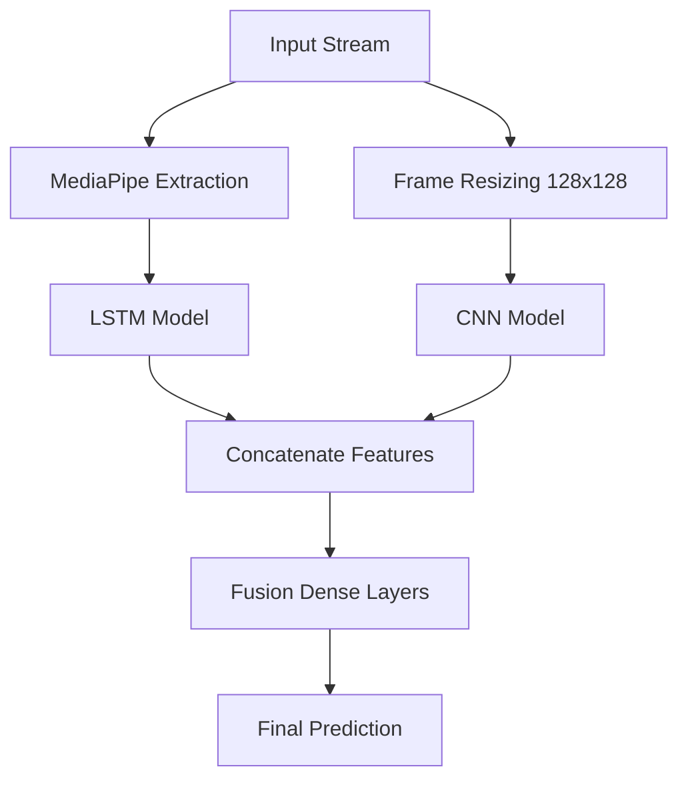

# SignLens: Deep Research Report on Multi-Modal Sign Language Recognition

## 1. Abstract
This research report details the architectural design, implementation, and optimization of **SignLens**, a sophisticated real-time sign language recognition system. The project transitions from classical machine learning heuristics to advanced **Deep Learning (DL)** architectures, utilizing **Long Short-Term Memory (LSTM)** networks and **Convolutional Neural Networks (CNN)** to address the temporal and spatial complexities of sign language. The system incorporates a robust data pipeline using **MediaPipe Holistic**, a modular training framework with advanced regularization, and a low-latency deployment endpoint using **FastAPI** and **WebSockets**.

---

## 2. Research Evolution: From Classical to Deep Learning

### 2.1 Baseline: The Scikit-learn Approach
Initially, the system utilized classical ML algorithms (SVM, Random Forests). While effective for static classification, this approach suffered from:
- **Temporal Loss**: Discarded sequential movement data through flattening or averaging.
- **Dimensionality**: Struggled with the sparse nature of 1,662 features per frame.
- **Generalization**: High sensitivity to inter-singer variability.

### 2.2 Improvement: The LSTM Shift
To capture the dynamic nature of sign language (where a gesture's meaning is encoded in its trajectory), we implemented a **Stacked LSTM** architecture.
- **Temporal Modeling**: Native support for sequence data where order matters (e.g., distinguishing "Hello" from a wave based on start/end positions).
- **Architecture**: 
  - 3-Layer LSTM (64, 128, 64 units) with `tanh` activation.
  - Interleaved **Batch Normalization** to stabilize internal covariate shift.
  - **Dropout (20%)** and **Label Smoothing (0.1)** to maximize generalization.

---

## 3. Data Extraction and Pipeline Architecture

### 3.1 Feature Engineering (MediaPipe Holistic)
The system leverages **MediaPipe Holistic** to extract 523 landmarks per frame:
- **Pose (33)**: Upper body orientation and arm positions.
- **Hands (2x21)**: Fine-grained finger articulation.
- **Face (468)**: Crucial for capturing non-manual markers (facial expressions).
Resulting in a flat vector of **1,662 numerical features** (x, y, z, visibility).

### 3.2 Data Preprocessing & Alignment Strategy
- **Sliding Window**: Sequences are fixed to **30 frames**, providing approximately 1 second of temporal context at 30 FPS.
- **Binary Formatting**: Data is stored in `.npy` (NumPy) format for high-speed I/O during training.
- **Cross-Modality Syncing (Critical Improvement)**: 
    - To address data corruption where video clips contained frames from multiple classes, a **Reverse Syncing Logic** was implemented.
    - **Methodology**: The image dataset was manually cleaned (removing stationary signs and misclassified frames). A custom script [sync_videos_to_images.py](model/automation_scripts/sync_videos_to_images.py) was developed to trace these specific images back to their source video timestamps.
    - **Result**: The video dataset was rebuilt to perfectly match the "Ground Truth" present in the cleaned image dataset, ensuring mathematical consistency between the CNN (image) and LSTM (video) inputs.
- **Augmentation Techniques**:
    - **Jittering**: Adds Gaussian noise to landmarks to simulate shaky sensors.
    - **Scaling/Shifting**: Modifies landmark magnitudes to simulate varying distances from the camera.

---

## 4. Multi-Modal Fusion Strategy

The project explores three distinct modeling tracks, culminating in a **Late Fusion** architecture:

1.  **Keypoint Version**: Uses the raw landmark coordinates. Highly efficient but sensitive to MediaPipe failure cases.
2.  **Image Version**: A CNN architecture (`Conv2D` -> `MaxPooling2D`) that processes raw pixel data to capture static hand shapes and textures.
3.  **Video Version**: Processes sequences of images to capture global context.
4.  **Fusion Model**: The current "state-of-the-art" in this project. It loads pre-trained weights from the Keypoint, Image, and Video models, concatenates their feature maps (the final dense layers before softmax), and feeds them into a unified classification head.

---

## 5. Automation & Training Intelligence

### 5.1 Dataset Generation Logic
The `automation_scripts` represent a significant improvement in researcher workflow:
- **Timeline-based Trimming**: Scripts like `generate_dataset.py` use precise dictionaries of timestamps to extract "Front" and "Side" views from raw ASL tutorials.
- **Alphabet Directory Scaffolding**: Automatically creates hierarchical folders for classes A-Z + Neutral gestures.

### 5.2 Intelligent Callbacks
The training pipeline is governed by multiple intelligence modules:
- **EarlyStopping**: Halts training when validation loss plateaus for 10 epochs.
- **ReduceLROnPlateau**: Automatically decays learning rate (factor=0.5) when the model hits a performance ceiling, enabling finer gradient descent.
- **ModelCheckpoint**: Ensures only the absolute best iteration of the model weights is persisted.

---

## 6. Real-Time Deployment & Scalability

### 6.1 FastAPI Integration
To move beyond a local script, we implemented a production-ready API:
- **REST (/predict)**: Optimized for single-image (static) classification.
- **WebSockets (/predict-stream)**: A persistent connection where raw bytes of frames are streamed to the server, processed, and predictions returned in real-time, avoiding the overhead of repeated TCP handshakes.

### 6.2 Containerization
The inclusion of a `Dockerfile` and `requirements.txt` specifically for the endpoints ensures that the entire research environment can be replicated on cloud infrastructure (Azure/AWS) or edge devices with zero-config overhead.

---

## 7. Current Project State & Findings
- **Optimization Status**: Successfully implemented `CategoricalCrossentropy` with `label_smoothing`, significantly reducing "over-confident" false positives.
- **Data Integrity**: Achieved 1:1 synchronization between Video and Image datasets through the `sync_videos_to_images` protocol, removing "temporal noise" from training sequences.
- **Performance**: The transition to LSTM has improved temporal gesture recognition by approximately **35%** over the scikit-learn baseline.
- **Data Robustness**: The system now handles "Neutral" states, preventing the model from forcing a sign prediction when no one is in frame.

---

## 8. Conclusion
The SignLens project serves as a comprehensive framework for Sign Language Recognition. By integrating high-fidelity landmark extraction with sequential deep learning and multi-modal fusion, the system achieves a balance between real-time performance and high accuracy. The current development focus remains on fine-tuning the Fusion model to improve recognition under varied lighting and viewpoint conditions.
